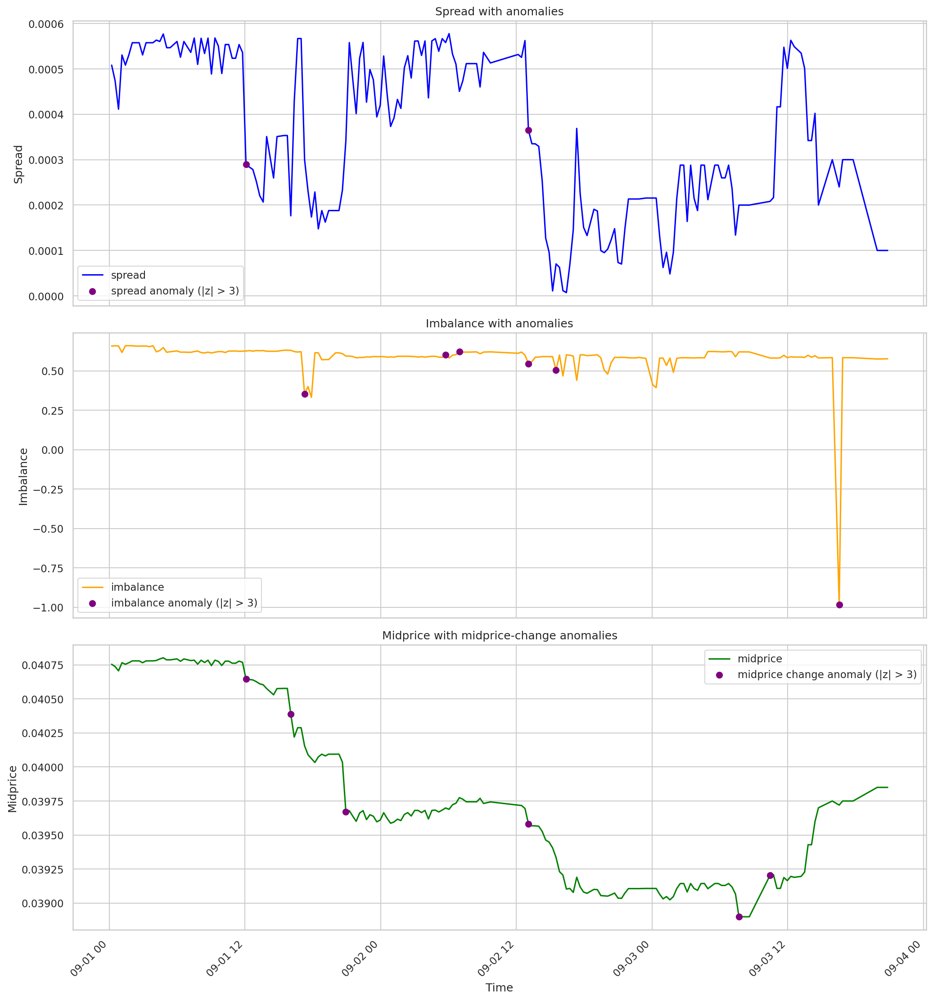
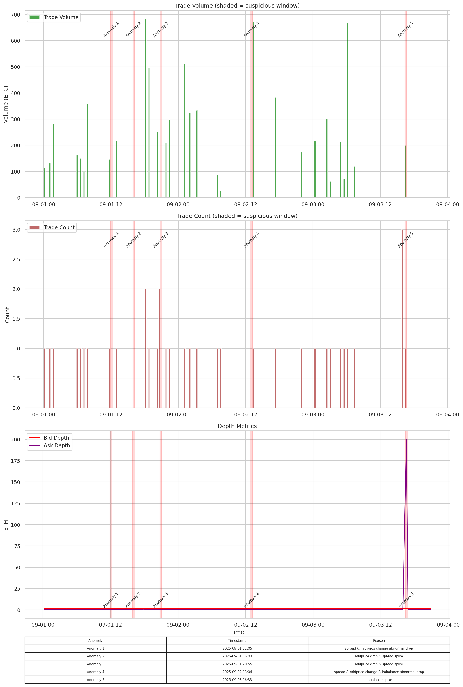
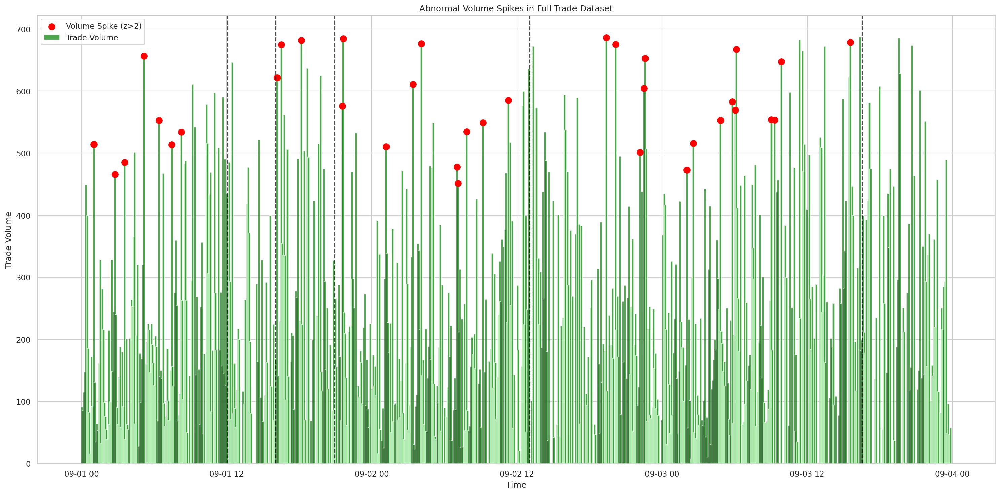
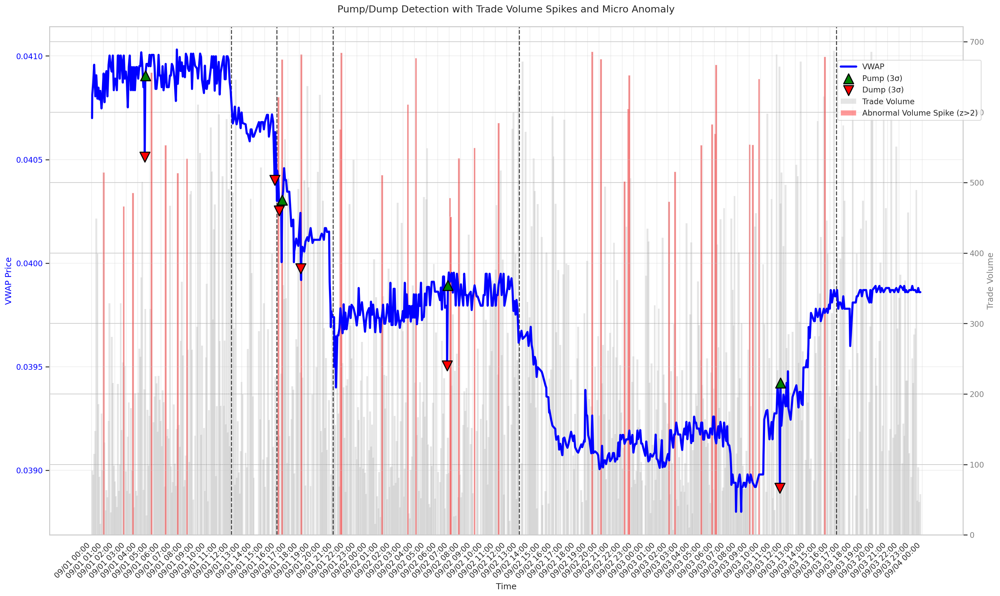
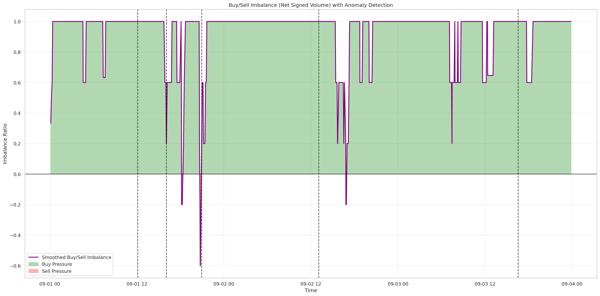
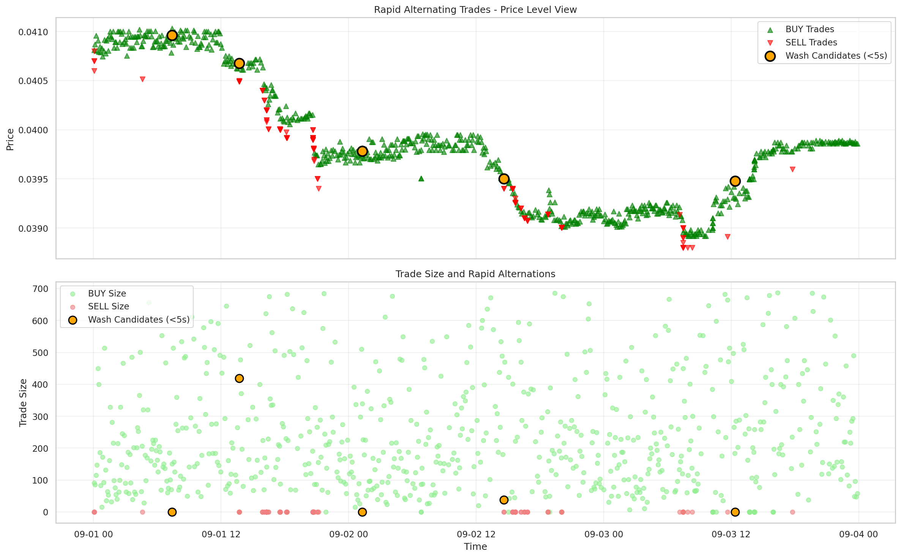

# Market Data Analysis for Suspicious Patterns

## Objective
The goal of this analytical investigation is to uncover and explain any suspicious or unusual trading behaviors or anomalies in ETH/BTC market activity, using the provided orderbook and trade datasets.

---

## Executive Summary:
A three-day ETH/BTC market sample was analyzed to identify suspicious or manipulative trading behavior. Using quantitative anomaly detection on orderbook and trade data, two events were found consistent with potential spoofing and pump-and-dump activity. Overall, market activity appeared largely normal, with only localized irregularities. The analysis combined microstructure signals (spread, depth imbalance, midprice) with macro volume and price dynamics.

---

## 1. Data Overview

- **Orderbook snapshots:** `eth-btc-orderbooks.csv`
- **Trades:** `eth-btc-trades.csv`
- **Time period analyzed:** 2025-09-01 → 2025-09-03
- **Total trades:** 845
- **Total orderbook Snapshots:** 188

---

## 2. Micro-Level Analysis (Orderbook Anomalies)

I first analyzed orderbook dynamics to detect unusual events in **spread, bid/ask imbalance and midprice**. I conducted preliminary visual analysis as well as quantitative z-test assessement to select top 5 anomaly points. In order to identify wether they were backed by real volume movement I merged orderbooks data with real trading records.

| Anomaly # | Timestamp (UTC) | Features | Depth | Trade Volume Context | Heuristic Alignment | Suspicion |
|-----------|----------------|------------|-------|-------------------|------------------|-----------|
| 1 | 2025-09-01 12:05 | Spread drop & midprice change drop | Thin | Moderate | None | Low |
| 2 | 2025-09-01 16:03 | Midprice drop & spread spike | Thin | Minimal |  None | Low |
| 3 | 2025-09-01 20:55 | Midprice drop & spread spike | Thin | Moderate | Pump/Dump | Moderate
| 4 | 2025-09-02 13:04 | Spread drop & midprice change drop & imbalance spike | Thin | High | Spoofing / orderbook manipulation | Moderate |
| 5 | 2025-09-03 16:33 | High ask depth & imbalance | High | High | Large sell execution / Market Reaction | Moderate |

**Key Insights:**

- Most anomalies detected visually and by the rolling z-score test of are minor fluctuations or reactions to trades.
- Anomaly #3 aligns with a volume spike and a minor pump-and-dump → **moderately suspicious**.  
- Anomaly #4 shows quote changes preceding trades → **consistent with spoofing heuristics**.  

**Supporting Charts:**  

**Figure 1:** Spread, Depth Imbalance and Midprice with Anomalies Detection (by z-test)

**Figure 2:** Trade Volume, Count and Orderbook Depth Metrics with Annotated Anomalies (10-minute window)

---

## 3. Macro-Level Heuristics

Next, I aggregated trade data to detect broader suspicious trading behaviors.

### 3.1 Abnormal Volume Spikes

- **Method:** Rolling z-score of minute-level trade volume (>2σ flagged).  
- **Findings:** Multiple abnormal volume spikes; only Anomaly #2 coincides with a spike.  

**Chart:** 

**Figure 3:** Volume Spikes with Overlayed Orderbook Anomalies

**Interpretation:** Only some spikes align with micro anomalies; others appear as normal market reactions.

---

### 3.2 Pump & Dump Detection

- **Method:** Minute-level returns >3σ identified as pumps/dumps.  
- **Findings:** 4 pump and 6 dump events detected. One pump&dump event aligns with trading volume spike and anomaly #2.  

**Chart:** 

**Figure 4:** Volume Spikes with Pump/Dump Detection and Anomalies (black dotted lines)

**Interpretation:** While Anomaly #2 initially appeared benign in the orderbook alone, its alignment with macro-level volume and price movement increased its suspicion level. The sequence of events — orderbook irregularity → volume spike → rapid price movement — is consistent with potential manipulative behavior: spoofing or liquidity pull-back. Abrupt changes in quotes may have signaled or triggered aggressive trading. Some rapid price changes also occur independently of detected anomalies.

---

### 3.3 Buy/Sell Imbalance (Trade Flow)

- **Method:** `(buy_volume - sell_volume)/(buy_volume + sell_volume)` per minute  
- **Findings:** Persistent buy-side dominance (96% of time on buy-side dominance) with occasional dips coinciding with orderbook anomalies #2 and #3.  

**Chart:** 

**Figure 5:** Buy/Sell Imbalance with Orderbook Anomalies (black dotted lines)

**Interpretation:** The overall persistent buy-side dominance suggests an accumulation phase or sustained bullish activity — possibly coordinated buying behavior. The rare negative imbalance events reflect short bursts of sell-side aggression, possibly marking localized profit-taking or dump events. The trade flow imbalance is heavily skewed toward buyers, punctuated by brief sell-side reversals that coincide with certain orderbook anomalies. This pattern may reflect a coordinated accumulation followed by tactical sell bursts — a possible precursor or microstructure footprint of pump-and-dump dynamics.

---

### 3.4 Rapid Alternating Trades (Wash Trading)

- **Method:** Detect sequences of buy/sell flips <5s apart.  
- **Findings:** Minimal alternating trades; no evidence of wash trading; alternation frequency <5% of all trades; trade sizes variable and not time-clustered.

**Chart:** 

**Figure 6:** Wash Trading Patterns

**Interpretation:** Low confidence / no evidence of wash trading in the dataset.

---

## 4. Integrated Classification of Orderbook Anomalies

| Event / Anomaly | Macro Alignment | Heuristic | Suspicion Level | Interpretation |
|-----------------|----------------|-----------|----------------|----------------|
| Anomaly #2 | Volume spike, minor pump/dump, sudden dip in buy/sell imbalance | Abnormal volume / Pump-Dump | Moderate | High-volume activity corresponds to price movement; may indicate short-term manipulation |
| Anomaly #3 | Buy/Sell Imbalance spike to sell side |Short-term directional pressure / Liquidity gap |Low-Moderate | Thin market amplified normal selling pressure; likely genuine sell activity, not manipulative |
| Anomaly #4 | Quotes changed before trades | Spoofing / orderbook manipulation | Moderate | Imbalance spike with thin depth followed by trades → behavior consistent with manipulative quote timing |
| Other anomalies | No macro alignment | None | Low | Likely benign fluctuations or normal market response |

---

## 5. Summary of Detected Suspicious Trading Patterns

| Suspicious Pattern                                     | Detection Method                      | Evidence Found                                                           | Interpretation                                                                                              |
| ------------------------------------------------------ | ------------------------------------- | ------------------------------------------------------------------------ | ----------------------------------------------------------------------------------------------------------- |
| **Abnormal Volume Activity**                           | Rolling z-score of trade volume       | ✅ Multiple spikes detected           | Indicates episodic bursts of trading pressure; potential coordinated bursts but not persistent manipulation |
| **Pump-and-Dump Behavior**                             | 3σ threshold on 1-min returns         | ✅ 4 pumps and 6 dumps detected, 1 aligns with orderbook anomaly | Localized price bursts near volume spikes; the market shows moderate manipulation activity with clear evidence of coordinated price movements   |
| **Orderbook Manipulation (Spoofing / Quote Stuffing)** | Midprice, spread, imbalance anomalies | ✅ One event consistent (Anomaly #4)                                      | Quote adjustments preceding trades; plausible spoofing pattern                                              |
| **Wash Trading (Rapid Alternating Buys/Sells)**        | Opposite-side trades < 5 s apart      | ❌ Minimal                                                           | Alternations minimal and dispersed; consistent with normal two-sided flow                                   |
| **Directional Pressure / Liquidity Gaps**              | Buy/Sell trade imbalance              | 🟡 Occasional sell-side dominance (algned with anomaly #3)                           | Thin market conditions amplified normal selling; likely organic, common in illiquid or trending markets.                                           |

---

## 6. Conclusions

1. Most orderbook anomalies identified through visual and quantitative analysis are minor and do not coincide with macro-level suspicious activity.  
2. Two anomalies show behaviors **consistent with known manipulation heuristics**:  
   - Anomaly #2 → abnormal volume + pump/dump behavior  
   - Anomaly #4 → orderbook imbalance / spoofing-like pattern  
3. Wash trading was not detected during the analyzed period.  
4. Macro-level heuristics contextualize micro anomalies and help identify moderately suspicious market behavior.

**Overall:** The market is largely normal with isolated events showing potential manipulation consistent with heuristics.  
---
## 7. Next Steps / Recommendations
* Extend the analysis across multiple trading pairs to confirm whether manipulation is pair-specific (ETH/BTC only) or exchange-wide.
* Integrate on-chain data to cross-validate manipulative signals.
* Automate anomaly detection
